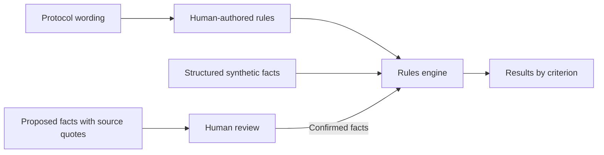
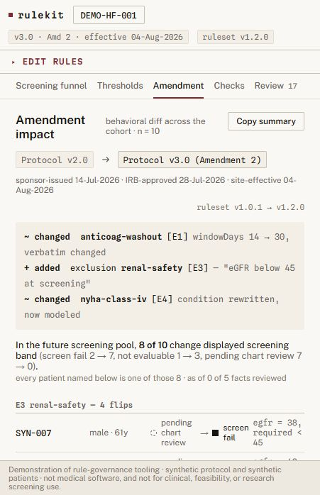

# RuleKit

RuleKit is a prototype for reviewing clinical trial eligibility criteria and protocol amendments. It keeps the protocol wording beside each encoded rule and shows how a change affects a synthetic cohort.

## Clinical operations

The browser workbench lets you:

- Compare protocol versions and see which criteria change a participant's result.
- Adjust a threshold and inspect its effect on ten synthetic participants.
- Review a proposed fact against its source quote before confirming it.

I'm looking for clinical operations professionals and trial managers to review a public criterion or an amendment scenario with me. Try the [five-minute walkthrough](docs/clinical-collaboration.md#five-minute-demo-route). No coding or patient data needed.

## Engineers

A shared TypeScript engine powers the CLI and React workbench. Rules live in versioned YAML. Tests cover boundary values, missing evidence, malformed inputs, and review behavior. The demo runs locally without a backend or account.

[Setup, tests, and architecture](docs/development.md) · [Rule format](FORMAT.md) · [CLI guide](docs/cli-guide.md) · [Contributing](CONTRIBUTING.md)

## How it works

A person writes the rules and reviews facts proposed from notes. The engine applies the rules; missing evidence remains unknown. It also checks for some kinds of contradiction and compares results across rule versions.

Workbench screenshot

## Current limits

All patient data is synthetic. RuleKit has no clinical validation and is not for real patient screening or enrolment. There is no EHR integration, authentication, or durable audit trail. See the [format limitations](FORMAT.md#8-known-limitations) and [security notes](SECURITY.md).

To collaborate, [open an issue](https://github.com/emmcygn/rulekit/issues/new?template=collaboration.yml) or message me on LinkedIn.

[Project direction](docs/project-brief.md) · [Apache-2.0 license](LICENSE) · [Data and asset notices](THIRD_PARTY_NOTICES.md)
