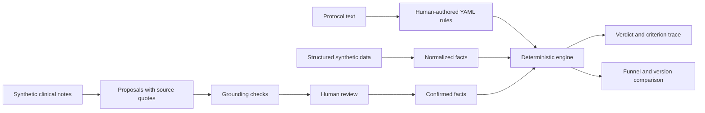

# RuleKit

**Make clinical-trial eligibility rules easier to inspect, test, and change.**

RuleKit is a working prototype that turns eligibility criteria into versioned YAML rules, checks for some kinds of contradiction, and shows how a protocol amendment changes results for a synthetic cohort. It includes a TypeScript engine, CLI, and browser workbench.

**I'm looking for clinical operations professionals and trial managers to help shape the next step.** Read the [clinical collaboration brief](docs/clinical-collaboration.md) for a short walkthrough and a concrete first contribution. No coding or patient data required.

> **Demonstration only.** All patient data is synthetic. RuleKit has no clinical validation and is not for real patient screening, enrolment, or operational feasibility decisions.

| Start here | What you can explore |
| --- | --- |
| Clinical operations, trial managers, medtech users | [Walkthrough and collaboration brief](docs/clinical-collaboration.md) |
| Engineers | [Local setup](#run-it-locally), [architecture and development](docs/development.md), [format specification](FORMAT.md) |
| Investors and hiring managers | [Implemented capabilities, open questions, and milestones](docs/project-brief.md) |
| Rule authors | [CLI examples](docs/cli-guide.md) and [contribution guide](CONTRIBUTING.md) |

## The question behind the project

When an eligibility threshold changes, which participants in a supplied cohort get a different result, and which rule caused it?

RuleKit makes that question executable. A rule keeps the source wording beside its interpretation:

```yaml
- id: renal-safety
  ref: E3
  kind: exclusion
  verbatim: "eGFR below 45 at screening"
  when: { fact: egfr, op: lt, value: 45 }
```

This fragment comes from the synthetic demo protocol. The [fact model](packs/trials/fact-model.yaml) declares the type and unit of `egfr`; the format does not infer them from prose.

The demo's eGFR band from 30 up to 45 meets the minimum inclusion but triggers a safety exclusion. This is ordinary eligibility behavior, deliberately **not** called a contradiction.

## Run it locally

Use **Node 22.22.2**, pinned in [.nvmrc](.nvmrc), and npm. Older Node 20 and early Node 22 releases do not satisfy the locked dependencies. Run these commands from the repository root:

```sh
git clone https://github.com/emmcygn/rulekit.git
cd rulekit
npm ci
npm run dogfood
npm --prefix web ci
npm --prefix web run dev
```

Open [localhost:5173](http://localhost:5173). No account or API key is needed for the demo. Install the root dependencies first: the workbench imports the shared engine.

These commands work in Bash and PowerShell. If PowerShell blocks `npm.ps1`, use `npm.cmd`. For an existing checkout, start at `npm ci`.

Try **Amendment** to compare the bundled protocol versions, then **Review** to inspect a proposed fact and its source quote. The browser cohort contains **10 hand-written synthetic patients**. Review decisions persist in browser local storage; use a fresh browser profile for an untouched demonstration.

[More CLI examples](docs/cli-guide.md) · [Full setup and verification](docs/development.md)

<details>
<summary>See the workbench: amendment comparison on a narrow screen</summary>


Actual local workbench capture, with no review actions applied. The UI's displayed screening bands include chart-review state, so they can differ from the CLI's three overall verdict categories.

</details>

## What works today

| Capability | Implemented behavior | Boundary |
| --- | --- | --- |
| Versioned criteria | YAML rules, independent format specification, JSON Schemas, boundary tests | A person translates the protocol; that interpretation still needs review |
| Static checks | Numeric interval contradictions and simple incompatible code constraints through `all` | Unsupported logic emits `analysis-incomplete`; a clean check is not proof of consistency |
| Cohort evaluation | Per-criterion `pass`, `fail`, or `unknown`, with an overall verdict and trace | Missing evidence remains unknown; results describe the supplied facts and encoded rules |
| Amendment comparison | Structural differences and changed synthetic patient verdicts, with responsible criteria | No demonstrated effect on amendment cost, recruitment, or patient outcomes |
| Proposed-fact review | Source quotes, grounding checks, confirm/edit/reject controls | Recorded synthetic examples; browser review is unauthenticated and is not a durable audit record |
| Data preparation | Synthea flattening, seeded corruption, normalization, quarantine | A narrow synthetic pipeline, with no EHR integration |

## How it works



The model proposes facts; it does not issue eligibility verdicts. Proposed narrative facts are withheld until confirmed. Structured inputs are a separate path and require trustworthy upstream preparation. Quote grounding checks source presence, not clinical correctness.

The CLI and workbench share a browser-safe engine. The workbench bundles repository fixtures at build time. Editor changes stay in browser state; there is no patient-upload feature.

## Evidence you can inspect

- **Two trial packs:** [the synthetic heart-failure demo](rules/trials/demo-hf-001) and [a translation of COMMANDER HF registry criteria](rules/trials/commander-hf). COMMANDER HF has 12 criteria: 8 executable, including 2 explicitly partial translations, and 4 retained as unmodeled text. This is not a validated screening implementation.
- **Synthetic inputs:** 10 edge-case patients, 100 Synthea-derived patients, and 10 authored clinical notes. [Provenance and transformations](docs/data-pipeline.md) are documented.
- **Recorded extraction evaluation:** 57 true positives, 1 false positive, and 1 false negative against 58 expected facts in 10 authored notes: 98.3% precision and recall. This is a fixed fixture result, not real-record performance. Run `npm run facts:eval`.
- **Tests and CI:** engine behavior, malformed inputs, adversarial cases, extraction checks, browser interactions, and walkthrough checks. [Development commands](docs/development.md) explain their scope.
- **Exploratory CHIA analysis:** [criterion text classified with heuristics](docs/chia-coverage.md). Its percentages are not human-validated translation accuracy.

## Help shape the next step

The next milestone is a small workflow study with people who manage protocols and screening operations: choose one amendment-review task, inspect a public protocol translation, create synthetic edge cases, and define a useful comparison with the current process.

The project does not establish clinical effectiveness or commercial demand. The [project brief](docs/project-brief.md) separates implemented behavior from hypotheses and proposed milestones.

**Interested?** Reply to or message me through the LinkedIn post that brought you here, or [open a collaboration issue](https://github.com/emmcygn/rulekit/issues/new?template=collaboration.yml). See the [collaboration brief](docs/clinical-collaboration.md) for what an initial conversation would cover.

## Scope and limitations

There is no EHR connection, real-chart validation, authentication, shared approval workflow, or durable audit trail. The engine does not convert units, expand terminology hierarchies, or provide general temporal reasoning. Unmodeled criteria remain visible as unknown.

The local engine and CLI require no backend or account. Optional live extraction calls an external model provider; the default demonstration uses committed recordings. Browser pages may request external fonts. See [development](docs/development.md), [security](SECURITY.md), and the [format limitations](FORMAT.md#8-known-limitations).

## License and related work

Code and format: [Apache-2.0](LICENSE). Data and vendored assets have their own [attribution and notices](THIRD_PARTY_NOTICES.md). All patient records and notes are synthetic.

Related work includes [OHDSI Criteria2Query](https://github.com/OHDSI/Criteria2Query), [ATLAS](https://github.com/OHDSI/Atlas), and [HL7 CQL](https://github.com/HL7/cql). RuleKit is an inspectable implementation experiment in this space; it makes no claim to be the first or only one.
